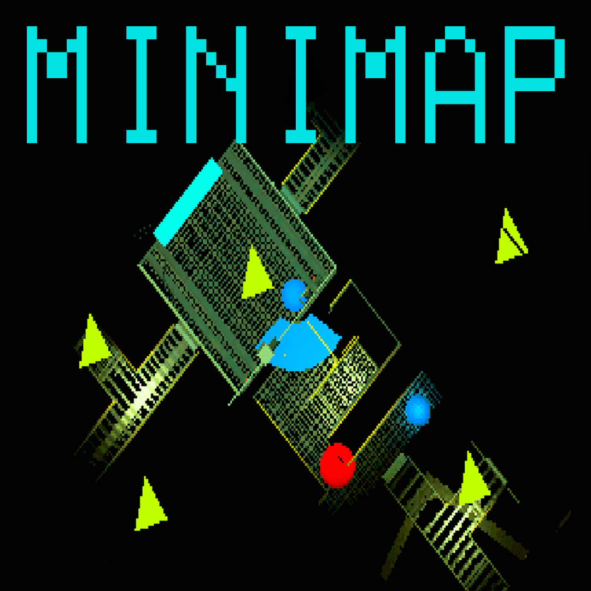
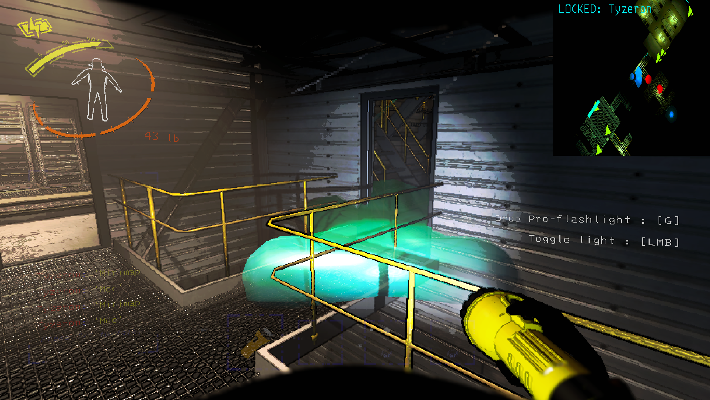
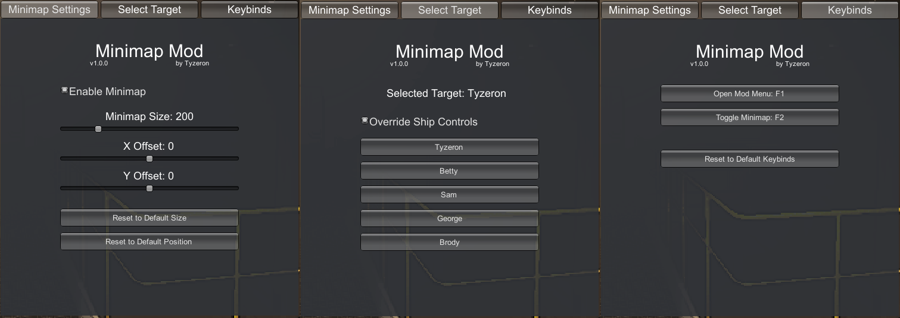

# Lethal Company Minimap

Introducing a **Minimap mod** for Lethal Company, a dynamic solution designed 
to enhance your gaming experience. This mod seamlessly integrates a persistent 
minimap on your screen, ensuring that you're never left in the dark, whether 
you're playing solo or in co-op mode.

For solo players, this mod emulates the real-time information flow that would 
typically be provided by a partner stationed at the ship's terminal.

In co-op mode, the Minimap mod ensures that everyone can join in the excitement 
of venturing into the building, eliminating the need for one player to stay 
back at the ship.

# Usage

By default, press `F1` to open the Minimap Mod menu and press `F2` to toggle 
the Minimap visibility.

The Minimap size, position, and the hotkeys, can be customized via the mod menu.

By default, the Minimap is synced with the ship's control panel. However, you 
can override the ship controls. This way, you can ensure that the Minimap focus 
doesn't change even if your teammate switches to a different player in the ship.
It also allows you to switch the focused player on your Minimap without 
affecting the Minimap or ship map of other players.

This is a client-sided mod, meaning that other players don't need to have this 
mod installed.

<!--  -->

# Features

- Minimap that can be toggled on and off
    - You can toggle the Minimap via a configurable hotkey
- Customize the Minimap size
- Customize the Minimap position
- Switch Minimap focus without affecting other players map
    - or you can have the Minimap linked with the ship's control panel
- Customize all hotkeys, including the hotkey to open the mod menu and 
the hotkey to toggle minimap
- Easily reset specific (or all) configurable settings
- All settings configurable via a user-friendly in-game GUI
- All configurable settings saved across sessions
- Toggle visibility of different Minimap icons
    - Loots, Players, Terminal Codes, and Radar Boosters

# Installation

1. Install **BepInEx** (see [BepInEx Installation Guide](https://docs.bepinex.dev/articles/user_guide/installation/index.html))

2. Launch **Lethal Company** _once_ with **BepInEx** installed to generate necessary mod folders and files

3. Navigate to your **Lethal Comanpy** game directory and go to `./BepInEx/plugins`
    - The `BepInEx` and `plugins` folder should have been generated in the previous step
    - **Example:** `C:\Program Files\Steam\steamapps\common\Lethal Company\BepInEx\plugins`

4. Download the Minimap mod from the [Thunderstore](https://thunderstore.io/c/lethal-company/p/Tyzeron/Minimap/)

5. Copy the downloaded **DLL file** (ex. `Minimap-v1.x.x.dll`) to the `plugins` folder

6. Launch the **Lethal Comanpy** game and enjoy your new Minimap mod :)

# Dev Notes

This Minimap mod was a **weekend project**, so the code might be a little messy 
due to the rapid development focus. In line with Donald Knuth's philosophy that 
`early optimization is the root of all evil`, the initial aim was functionality 
rather than optimization.

Your feedback for improving and optimizing the code is warmly welcomed.

# Contact

I am primarily active on Discord, but my DMs are closed. So the most effective 
way to get in touch with me is via the 
[Trilobite Tavern](https://discord.gg/trilobitetavern) Discord Server.

I serve as a `System Administrator` on that server and am highly active there. 
I have decided to take this approach as it allows me to keep my focus on mod 
development, without the added responsibility of owning and maintaining 
my own Discord server.
